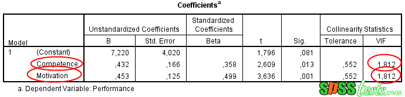
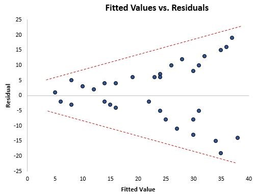

## WELCOME TO THE MODELING APP

The main purpose of the app is to fit linear regression models, time series models, 
IV regression models, Machine learning models and ridge regression model. Please use the following steps.

After uploading your file, please remember to choose the portion of your data set that you want to be used for training purposes. The app will use the remaining portion of your data set to carry out testing in order to evaluate the performance of the model.

If your data set has missing values; the app will drop them prior to fitting models.

Step 1: Select an Excel file of your choice (The file should have column names on the first row)

Step 2: Select a continuous dependent variable and some independent variables.

Step 3: Transformed data is also made available in case a user wants to change the form of the raw data. Several transformations are available: Change the raw data by 1. Natural log transformation, 2. First differences 3. Lags (maximum 4). 

Once these variables are chosen, the user has the choice of several different statistical techniques itemized below. 

1. The first statistical technique uses ordinary least squares (OLS) regression techniques. Our app offers 2 step-wise methods for optimizing ordinary least squares regression; namely, forward and backward step-wise regressions.

The second statistical technique also uses ordinary least squares (OLS) and includes 2 dummies meant to eliminate outliers. Their inclusion can tighten the regression model but comes at the cost of “over fitting” the regression by reducing the degrees of freedom by 2. 

The dummy variables are based upon standard errors and residuals, dummy 1 is equal 1 if the residuals are equal to or greater than the standard error and it is zero otherwise.

Dummy 2 is equal to 1 if the residuals are less than minus the standard errors, it’s zero otherwise.

2.	The third statistical technique offers corrections to the problems of multicollinearity (ridge regression model), Cochrane-Orcutt designed to correct for multi-collinearity.

A.	In statistics, multicollinearity is a phenomenon in which one predictor variable in a multiple regression model can be linearly predicted from the others with a substantial degree of accuracy. In this situation, the coefficient estimates of the multiple regression may change erratically in response to small changes in the model or the data. Our Ap offers Ridge Regression to correct for multicollinearity.

  

B.	Another key assumption of OLS is that the residuals are distributed with equal variance at each level of the predictor variable. This assumption is known as homoscedasticity. When this assumption is violated, we say that heteroscedasticity is present in the residuals. When this occurs, the results of the regression become unreliable.
One way to visually detect whether heteroscedasticity is present is to create a plot of the residuals against the fitted values of the regression model.
If the residuals become more spread out at higher values in the plot, this is a tell-tale sign that heteroscedasticity is present. Our Ap uses the weighted least squares (WLS) estimator to correct for heteroscedasticity. Often this specification is one of the regressors or its square.

  

3.	The fifth model employs time series models to the data. 

4. We have also the results of a time series model. The time series model is done first without lagging and also with lagging.
An autoregressive integrated moving average, or ARIMA, is a statistical analysis model that uses time series data to either better understand the data set or to predict future trends. 
The key assumption in any regression analysis is stationarity. In simple terms, if the data is stationary, past data can be used to forecast the future. Because consumer behavior was drastically altered during COVID, history was not a guide to its behavior during COVID. The data was NOT stationary. An Arima model divides the data into momentum, trend and error terms, represented by Arima(0,0,0). Once the data are appropriately de-trended (change the value of the middle 0 term usually to 1), past behavior of the data provides a guide to the momentum of the data going forward. Past values of the data will usually give you a good guess as to future values. To employ the correct value of the lag (change the first 0 to an appropriate lag value usually 1 or 2). To the degree that this is not true, the model offers an error correction term. Again, depending on how long these errors have persisted, change the third 0 to an appropriate lag value usually 1 or 2

**MORE DETAILS**

The App also includes test results for the presence of heteroscedacticity, multicollinearity and auto correlation.

The null hypothesis and alternative hypothesis for the auto-correlation test is;

**H0 (null hypothesis):** There is no correlation among the residuals.
**HA (alternative hypothesis):** The residuals are autocorrelated.

**N/B:** All the statistical tests are performed at 5% significance level; we reject the null hypothesis is the p-values is less than 5%.

## Machine Learning Models

Machine learning models are basically statistical models that can learn from data
and make predictions on new data. Currently the app handles classification machine learning models,
specifically logistic classification, decision tree classification, random forest classification, and
support vector machine classification.

